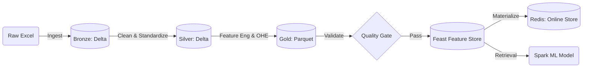

# Telco Customer Churn Pipeline: End-to-End MLOps

An enterprise-grade MLOps pipeline designed to predict customer churn. This project demonstrates a full **Medallion Architecture**, **Feature Store implementation**, **Data Validation**, and **Model Training**(WIP), orchestrated entirely via **Apache Airflow** and **Docker**.

---

## Architecture & Design

This project follows the **Medallion Architecture** pattern to progressively improve data quality, integrated with a modern Feature Store for ML readiness.



### **Key Design Choices**

1. **Spark for All Layers:** We use PySpark for Bronze, Silver, and Gold layers to ensure the pipeline is horizontally scalable, capable of handling terabytes of data, not just the sample CSV.
2. **Delta Lake for Bronze/Silver:** We use Delta format for early layers to leverage ACID transactions, schema enforcement, and audit history (Time Travel).
3. **Parquet for Gold:** The Gold layer is stored as Parquet to serve as the "Offline Store" for **Feast**. This ensures native compatibility without complex connectors.
4. **Feast as the Serving Layer:** Instead of a static database, we use Feast to decouple _Feature Engineering_ (Spark) from _Feature Serving_ (Redis/Model).This prevents training-serving skew.
5. **Strict Validation Gate:** A dedicated validation step ensures no corrupted data enters the Feature Store, protecting downstream models from silent failures.

---

## Tech Stack

- **Compute:** Apache Spark (PySpark)
- **Orchestration:** Apache Airflow
- **Storage:** MinIO (S3 Compatible Object Storage)
- **Formats:** Delta Lake (Bronze/Silver), Parquet (Gold)
- **Feature Store:** Feast
- **Online Store:** Redis
- **Containerization:** Docker & Docker Compose

---

## Setup & Usage

> **Important:** This setup is intended for local development and testing with hard-coded credentials. For production deployments, consider using managed services and secure configurations with secret managers to handle credentials.

### 1\. Prerequisites

- Docker Desktop installed (4GB+ RAM recommended).

### 2\. Infrastructure Startup

Start the entire stack (Spark, Airflow, MinIO, Redis):

```bash
docker build -t dag-spark:v1 -f ./docker/spark/Dockerfile .

docker compose up -d
```

> NOTE: Name of the image must be _dag-spark:v1_ for Airflow to connect to Spark.

### 4\. Run the Pipeline

1. Navigate to Airflow: `http://localhost:8080` (User/Pass: `admin`/`admin`).
2. Enable the `01_etl` DAG.
3. Trigger the DAG manually.

### 5\. Verify Results

- **Airflow:** All tasks (Ingest -\> Clean -\> Engineer -\> Validate -\> Feast -\> Train) should be Dark Green.
- **Model:** Check the logs of the `train_model` task to see the Accuracy score.
- **Feature Store:** Run the exploration script to see data fetched from Redis:

---

## Data Lineage & Tracking

- **Process Lineage:** Handled by Airflow DAGs.
- **Data Lineage:** Handled by Delta Lake Transaction Logs (`_delta_log`).
- **Feature Lineage:** Handled by Feast Registry, linking Models -\> Features -\> Gold Files.
